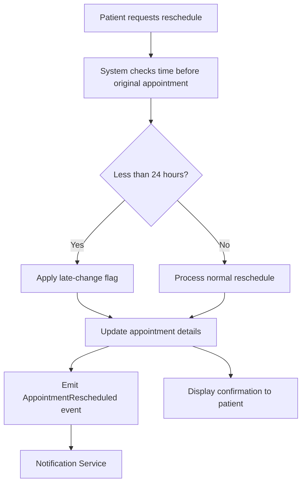

# Appointment Rescheduling – Late-Change Handling

## User Story

**Title:** Patient Reschedules an Appointment Within 24 Hours

**As a** patient,  
**I want to** reschedule my scheduled appointment,  
**so that** my appointment details are updated and the appropriate late-change process is applied when I reschedule less than 24 hours before the original appointment time.

---

## Scenario

### Late Rescheduling Within 24 Hours

**Given** a patient has a scheduled appointment for `2026-10-15T10:00:00Z`  
**When** the patient requests a reschedule to `2026-10-16T14:00:00Z` less than 24 hours before the original appointment time  
**Then** the system should apply a late-change flag  
**And** emit an `AppointmentRescheduled` event to the Notification Service  
**And** display a confirmation message with the updated appointment details to the patient.

---

## Acceptance Criteria

### AC1 – Detect Late Rescheduling
- The system must compare the reschedule request time with the original appointment time.
- If the reschedule is requested less than 24 hours before the original appointment, the appointment must be marked as a late change.

### AC2 – Apply Late-Change Flag
- A late-change flag must be applied to the appointment.
- The flag should remain associated with the updated appointment record.

### AC3 – Emit Notification Event
- The system must emit an `AppointmentRescheduled` event to the Notification Service.
- The event should contain the relevant appointment and updated scheduling details.

### AC4 – Confirm the Reschedule
- The patient must receive a confirmation message after the reschedule is successfully processed.
- The confirmation must show the updated appointment date and time.

### AC5 – Update Appointment Details
- The original appointment time must be replaced with the new appointment time.
- The system should retain the information required to identify that the appointment was rescheduled.

---

## Example Data

| Field | Original | Updated |
|---|---|---|
| Appointment Date/Time | `2026-10-15T10:00:00Z` | `2026-10-16T14:00:00Z` |
| Change Type | Scheduled | Rescheduled |
| Late-Change Flag | Not Applied | Applied |
| Notification Event | None | `AppointmentRescheduled` |

---

## Expected Notification Event

```json
{
  "eventType": "AppointmentRescheduled",
  "originalAppointmentTime": "2026-10-15T10:00:00Z",
  "newAppointmentTime": "2026-10-16T14:00:00Z",
  "lateChange": true
}
```

---

## Process Flow



---

## Definition of Done

- [ ] Reschedule request is accepted.
- [ ] System determines whether the request is within 24 hours of the original appointment.
- [ ] Late-change flag is applied when applicable.
- [ ] Appointment details are updated.
- [ ] `AppointmentRescheduled` event is emitted.
- [ ] Notification Service receives the event.
- [ ] Patient sees confirmation with the updated appointment details.
- [ ] User story and acceptance criteria are committed to the team GitHub project.
