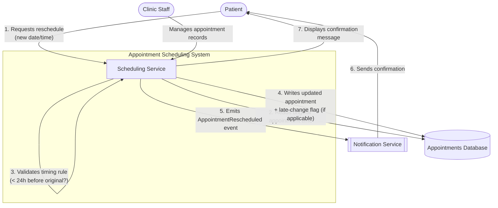

# Context Diagram — Appointment Rescheduling Feature

This is a **System Context Diagram**: it shows the feature as a single box, the actors/external systems that interact with it, and the direction of the data/event flow. It intentionally does *not* show internal components — that level of detail belongs in a container/component diagram, not a context diagram.

## Actors & Systems

| Name | Type | Role |
|---|---|---|
| Patient | External actor | Initiates the reschedule request; receives confirmation |
| Clinic Staff | External actor | Manages/oversees appointment records (context for scope) |
| Scheduling Service | Core system (in scope) | Owns the reschedule logic, including the 24-hour late-change rule |
| Appointments Database | Data store | Source of truth for original appointment times |
| Notification Service | External system | Receives the `AppointmentRescheduled` event and notifies the patient |

## Notes on scope
- The 24-hour rule is evaluated by comparing the **time the reschedule request is received** against the **original appointment's start time** — not the new appointment time. This distinction matters for the acceptance criteria below.
- The Notification Service is treated as an external dependency the Scheduling Service integrates with via an event, not a component we're designing here.
